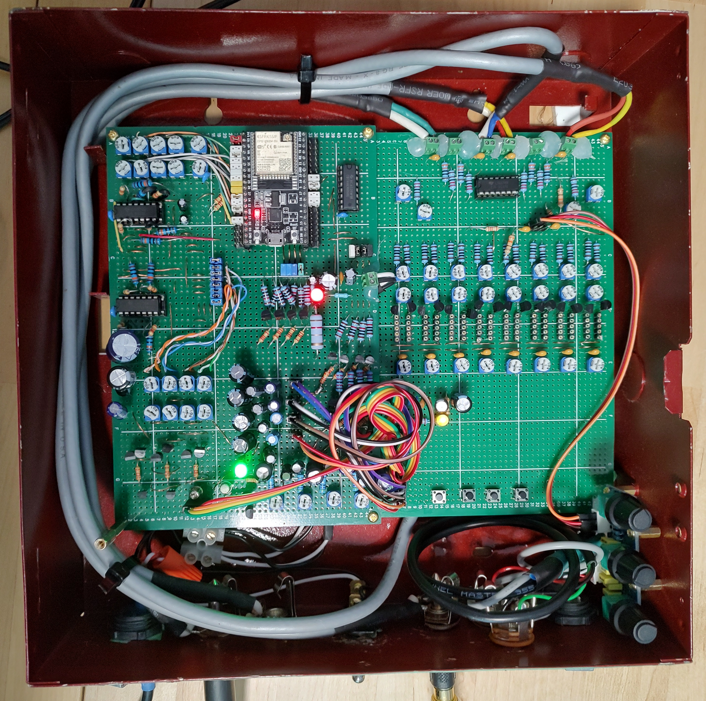

# Tomatoes' Drone Synth
An ESP32-based Drone Synthesizer, built for [Drone Day](https://droneday.org/) 2024

## Notes:
- I had to burn the ESP32's efuse for setting VDD_FLASH/VDD_SDIO because my board design used GPIO12 for input, which is a strapping pin, and the device would not boot otherwise. If recreating this circuit yourself, you have 3 options:
     - Use a different GPIO for that particular analog input (GPIO4 and GPIO2 are good candidates)
     - Disconnect the jumper for that pin when turning the board on, then reconnect it (this gets annoying fast)
     - Burn the efuse on your esp32. See [instructions from espressif](https://docs.espressif.com/projects/esptool/en/latest/esp32/espefuse/set-flash-voltage-cmd.html)
 - The code contains a mostly-finished MIDI receiver implementation that I wrote before pivoting the codebase from being a MIDI synth to a drone synth controlled by knobs. I left it in for anyone interested.

## About

Back during the COVID-19 lockdown, I had experimented with using a microcontroller as an oscillator for sound synthesis. The experiment did work, however the output was less than ideal, mostly because the "oscillator" was just the Arduino "loop()" function turning a pin on and off with a delay in between. After this I abandoned the idea for a few years.

Near the end of April 2024 I was fixing to mess around with sound again, and while figuring out what I was gonna do, I stumbled across a github repo that contained a [signal generator for the ESP32](https://github.com/vdeschwb/esp32-signal-generator) which repurposed an LED-controller function on the board to create PWM sound waves. I tried it out, and it worked somewhat OK, but it was controlled by a web interface over a WiFi hotspot, and that wasn't ideal for what I wanted to do.

So I went about planning my own synthesizer based on this LED controller driver, and breadboarded something with a few trimpots and flashed an esp with some hacked-together code, and to my amazement, it worked. However, there were a lot of different parameters that I would like to be able to adjust in real time, and I quickly realized using knobs to control all this would both use up too many analog inputs, take up too much space, and probably cost a lot for all the proper potentiometers.

I then decided to build a board that was completely MIDI-controlled, both for the musical input and the adjustment of all the various synth parameters. I built the tone generation board and began writing some firmware with a MIDI receiver implementation and it worked decently well. However, at this point all I had was a board that produced independent signals (the oscillators, LFOs, and ADSR), but didn't mix or modulate them at all. I started breadboarding some stuff, and got some decent results but quickly got frustrated with how janky a busy breadboard can be.

About this time I found out about the upcoming Drone Day and was kind of interested in showing this contraption, but at that point the project was still a small perfboard prototype wired into a breadboard, with a MIDI port dangling from alligator clips; all powered by a pretty hefty old benchtop variable power supply. Needless to say, it was not particularly easy to move around; nor did I have much of an output stage at this point.

A couple days later, I had an idea that would solve all my problems: Instead of proceeding with my original plan, I would build a simple drone synthesizer once again operated by trimpots; lob out some parts of the firware I'd written, and then figure out all the analog electronics. And over the course of about 2 weeks, I did, soldered it all down to 2 perfboards, and mounted it in a box with output jacks and a power switch.

### What's next
Well, through my 2-week rush to build something, I did learn a lot about building analog circuits through both research and mistakes. I also really started to see the pitfalls of building a monolithic synthesizer where everything is on one or two boards. I'm probably gonna take a bit of a break from synth building for a bit now; and once I resume, I'll probably go with a highly modular design, be that eurorack or something else. 

